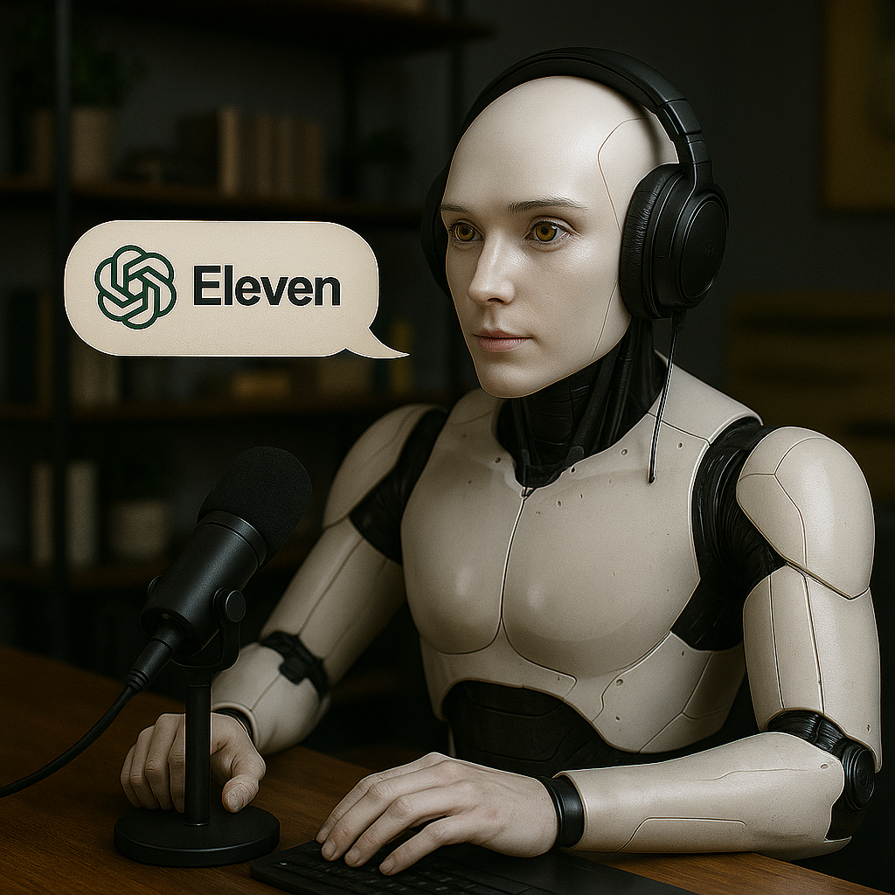

    Preview do podcast

    <audio src="output/podcast_editado.MP3" controls title="Podcast editado"></audio>

# Projeto Podcast Gerado por I.A.s

> ℹ️ **NOTA:** Este é o repositório que desenvolvi durante o curso [Microsoft 50 Anos - Prompts Inteligentes](https://web.dio.me/track/microsoft-50-anos-prompts-inteligentes) da [DIO](https://dio.me)

Criei este projeto com o objetivo de gerar um podcast utilizando ferramentas de inteligência artificial através de uma esteira de prompts bem estruturada.

Utilizei prompts otimizados em cada etapa do processo criativo.

## 💻 Tecnologias que utilizei no projeto

- [ChatGPT](https://chat.openai.com/)  
- [ElevenLabs](https://beta.elevenlabs.io/)  
- [CapCut](https://www.capcut.com/pt-br/)

## ✨ Como eu fiz

- Criei o roteiro com o ChatGPT  
- Gere o áudio com o ElevenLabs  
- Criei a capa com o GPT  
- Editei e tratei o áudio usando o CapCut, adicionando efeitos e trilha de fundo

## 📚 Materiais que usei

- [Link do curso Microsoft 50 Anos - Prompts Inteligentes](https://web.dio.me/track/microsoft-50-anos-prompts-inteligentes)  
- [Template no Notion](https://helpful-jump-17b.notion.site/PAS-Podcast-AI-Studio-210489e15d7a4a73b743bb159e45d06f?pvs=4)  
- [Editor de áudio do CapCut](https://www.capcut.com/editor?from_page=landing_page&__action_from=picture_V%C3%ADdeos%20profissionais%20em%20minutos,%20n%C3%A3o%20em%20horas.)

## 🛠️ Como eu executei o projeto

Segui o passo a passo com os prompts disponíveis no `Notion`, presente na seção de materiais, para criar o podcast de forma automatizada:

- 🤖 1. Usei os prompts de roteiro no `ChatGPT`  
- 🤖 2. Levei o roteiro para o `ElevenLabs` para gerar a narração  
- 🤖 3. Usei prompts para criar a arte da capa no `GPT`  
- 🎧 4. Finalizei o projeto no `CapCut`, ajustando o áudio com trilhas e cortes

## 👨‍💻 Expert

    
&nbsp;&nbsp;&nbsp;Wesley Carvalho 
    &nbsp;&nbsp;&nbsp;
    <a href="https://github.com/wesleycarvalhopereira">GitHub</a>
    &nbsp;|&nbsp;
    <a href="https://www.linkedin.com/in/wesley-carvalho/">LinkedIn</a>
    &nbsp;|&nbsp;
    <a href="https://www.instagram.com/wgold_/">Instagram</a>
    

  

---

⌨️ Criado por [Wesley Carvalho](https://github.com/wesleycarvalhopereira)  
🧠 Projeto inspirado e baseado no repositório do professor [Felipe Aguiar](https://github.com/felipeAguiarCode)
